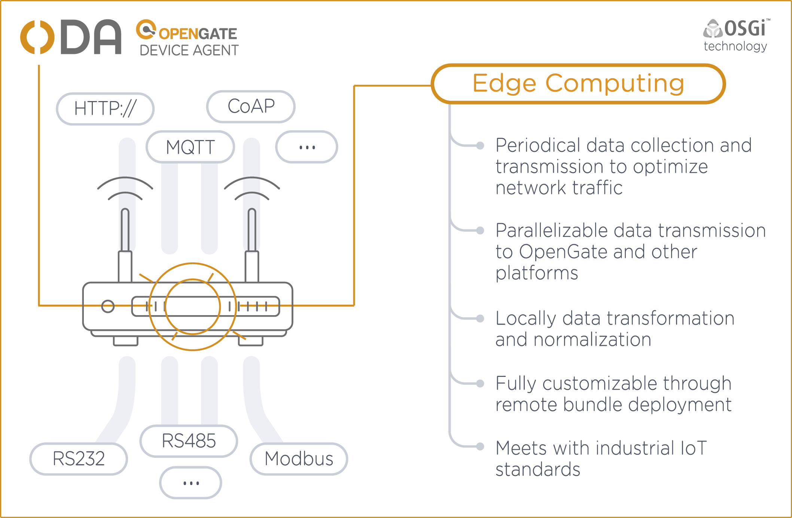

# ODA

ODA, responding to OpenGate Device Agent, is the software created by Amplía Soluciones S.L. to easily integrate your device data into our OpenGate IOT platform.

## Overview

ODA is built using the [OSGi specifications](https://www.osgi.org/developer/what-is-osgi/), a modular architecture that reduces complexity, increases reuse, eases deployment and provides dynamic updates.

The modular architecture allows tailoring a specific solution for a project in a few minutes, assembling the modules needed. You also taking advantage of a suite of highly tested and robust modules used on a big number of projects and situations. 

Adding your own business logic or protocols is also very easy. You just need to focus in the specific implementations, usually by implementing the interface of the service you want to provide, and integrate with the existing services.

## ODA Architecture

ODA is built on top of the [Apache Felix Framework](https://felix.apache.org/), an open source implementation of the OSGi Framework and Service platform, but is design to work with any of the OSGi framework implementations.

### Infrastructure

The software provides a common infrastructure to be used from any module:
* [__Core__](infrastructure/core.md): Core modules with common features.
* [__Comms__](infrastructure/comms.md): Communication modules used by different modules of the system (communication protocols used in WAN and LAN).
* [__Services__](infrastructure/services.md): Services to be used by any module (e.g. serialization services).
* [__Subsystems__](infrastructure/subsystems.md): General subsystems.

### Layers

ODA follows a multi-tier architecture with the next layers:

* [__Connectors__](layers/connectors.md): Send and received data to/from the Internet at a low level of abstraction (byte array).
* [__Operation Dispatcher__](layers/operationDispatcher.md): Converts low level data into high level representation, usually using a Serializer, to get the operation request and send it to the right operation processor. Once the operation is processed, it converts the response into low level data to send it again through the connector.
* [__Event Dispatcher__](layers/eventDispatcher.md): Converts data events into a low level data representation to send it through the connectors.
* [__Operations__](layers/operations.md): Implements a specific operation inside the device, like getting data, setting data or make a software update. It contains an interface to implement _custom operations_.
* [__State Manager__](layers/stateManager.md): Stores the device data state in the current moment. May have historical information. Uses the rule engine if available to trigger custom business rules each time the data is updated.
* [__Rule Engine__](layers/ruleEngine.md): Triggers custom business logic rules over the device data.
* [__Datastream Getters, Setters and Events__](layers/datastreams.md): Abstracts the data sources to ease the access to read and write data from the upper layers. Data sources may be GPIO, ADC, other devices connected through LAN protocols...
* [__Hardware__](layers/hardware.md): Abstracts the hardware specifics.

  

 
