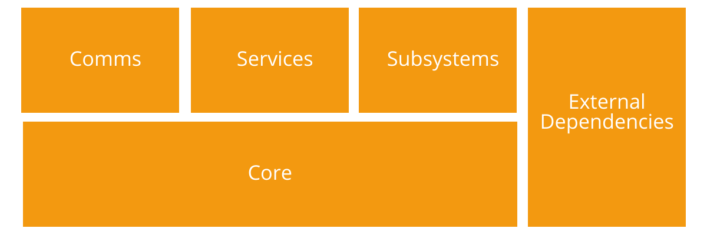

## Infrastructure

ODA provides a common infrastructure to be used from any module:
* [__Core__](infrastructure/core.md): Core modules with common features.
* [__Comms__](infrastructure/comms.md): Communication modules used by different modules of the system.
* [__Services__](infrastructure/services.md): Services to be used by any module (e.g. serialization services).
* [__Subsystems__](infrastructure/subsystems.md): General subsystems.

