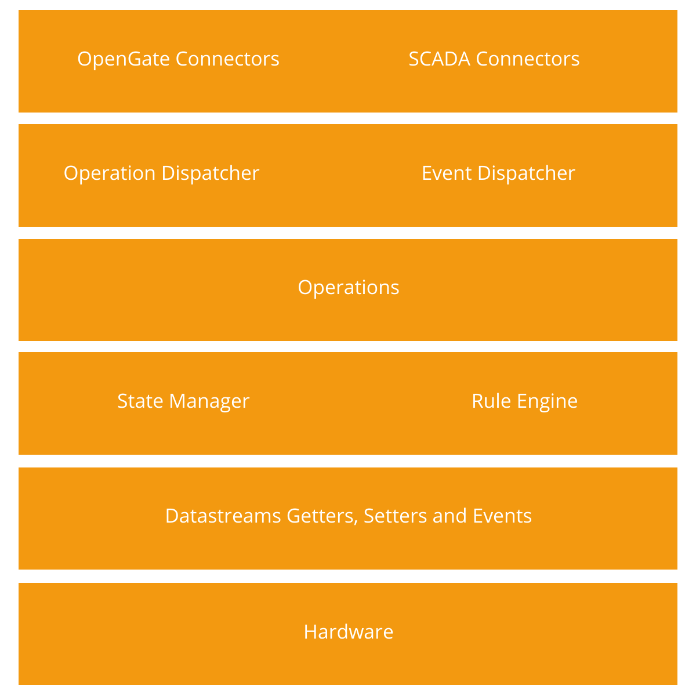

## Layers

ODA is composed of the following layers:

* [__Connectors__](layers/connectors.md): Send and received data to/from the Internet at a low level of abstraction (byte array).
* [__Operation Dispatcher__](layers/operationDispatcher.md): Converts from low level data into high level representation to process operations and send the responses.
* [__Event Dispatcher__](layers/eventDispatcher.md): Converts data events into a low level data representation to send it through the connectors.
* [__Operations__](layers/operations.md): Implements a specific operation inside the device.
* [__State Manager__](layers/stateManager.md): Stores the device data state in the current moment.
* [__Rule Engine__](layers/ruleEngine.md): Triggers custom business logic rules over the device data.
* [__Datastream Getters, Setters and Events__](layers/datastreams.md): Abstracts the data sources to ease the access to read and write data from the upper layers.
* [__Hardware__](layers/hardware.md): Abstracts the hardware specifics.

